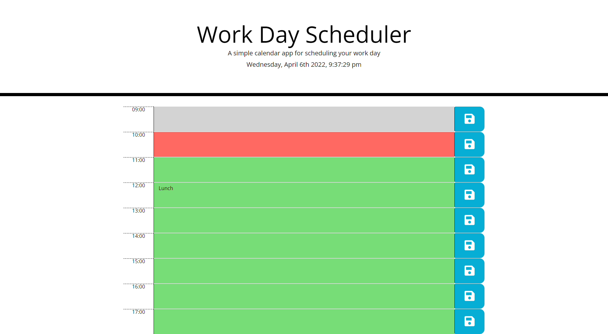

# Work Day Scheduler

## HTML / JavaScript
A day planner that allows the user to set hourly text and changes colors as time passes through the day.

## Deployed Site
[Day Planner](https://josephlmurray.github.io/day-planner/)

## Screen Shot

### Points of Interest
* Data is maintained locally and persists after refresh

* Time is loaded through moment then maintained on page

* Sections are created programatically
